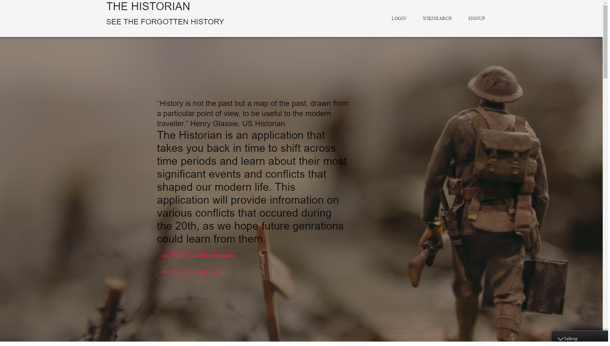
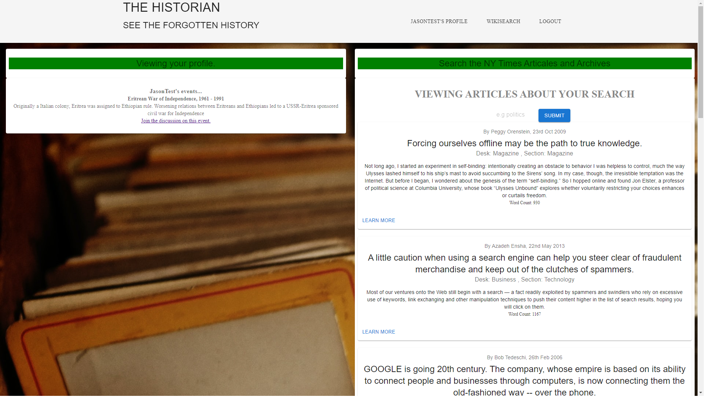
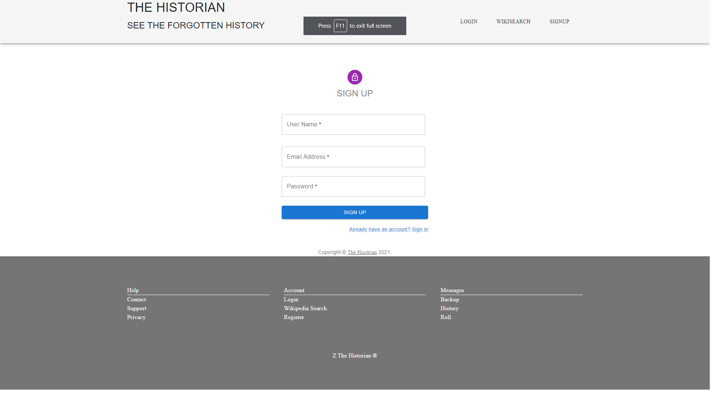
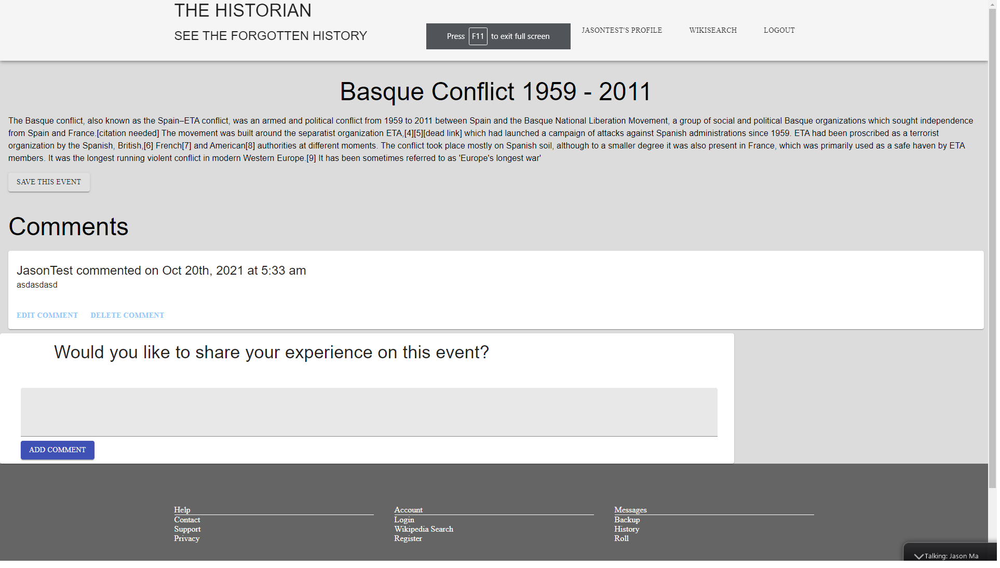
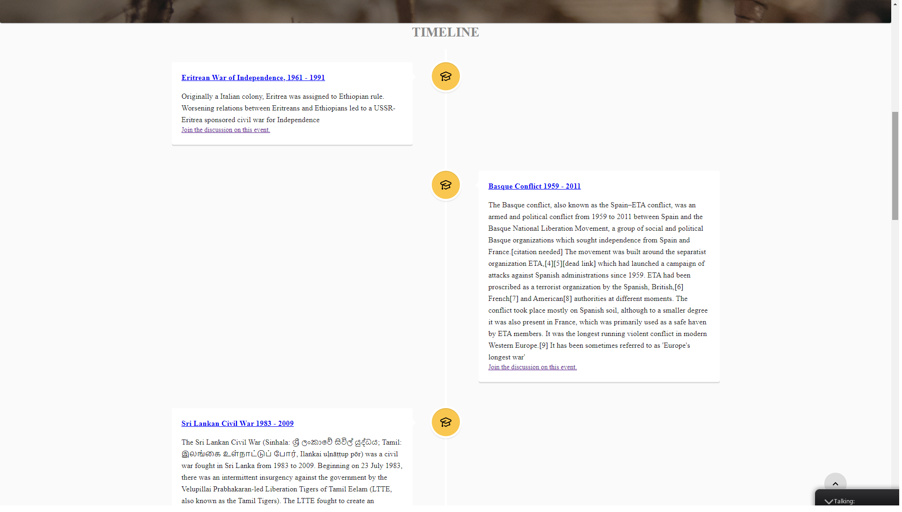
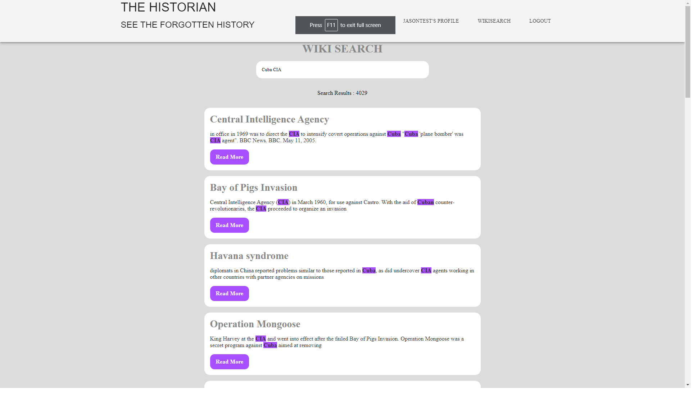

# The Historian
- The historian is an app that takes you back in time to shift across time periods and learn about their most significant events and conflicts that shaped our modern life.
- This application will host and describe various conflicts that occurred during the 20th. We hope to inform later generations of little-known wars. In addition, this application will allow Users to navigate through the timeline to learn about different conflict events that happend in the last 50 years.
- The Apllication also provide WIKI search engine as well as NY times search engine that provide modern and archived atricales based on the user search.

## About
Fully functioning Historical events search engine built using MERN stack with a React front end, MongoDB database, and Node.js/Express.js, GraphQL and Apollo Server. 

## Table of Contents
- [The Historian](#the-historian)
  - [About](#about)
  - [Table of Contents](#table-of-contents)
  - [Installation](#installation)
  - [User Story](#user-story)
  - [Usage](#usage)
  - [Screen Shots](#screen-shots)
 - [Technologies](#technologies)
  - [From developers](#from-developers)

## Installation
- You can visit the deployed app here : [Historian](https://historian-timeline.herokuapp.com/).
<!-- TODO: add the live Heroku link -->
- If you want to run the app on your local server download it through Github.
- Run npm i or (npm install), to make sure to download all the necessary files in the jason package.
- In your command shell run npm start.

## User Story

```md
-	As a History Teacher I want an app that helps me look for previous conflicts during the 80s and the 90s so I can save the data and use it during my classes.
-	As a veteran I want to add my first-hand accounts of real time events from my prospective on the front lines so provide people with some of the real stories.
-	As event survivor I want to share my experience so future generation can understand how war could be crucial.
-	As a Reporter I want an app that helps me search for conflicts by region or country which will helps me analyze the Data and use it in my investigations.
-	As a world traveler I want to visit several locations where a particular iconic moment / conflict took place so I can understand more how those moments shaped this region culture.
-	As online reader I want to have a great customer service support in case I have any problem with the products.
-	As online reader I don’t have my laptop with me all the time so I want a phone app, so that I can check those events with more convenience.
-	As online reader I want to have simple access and surfing through the website so that I don’t spend much time searching for the events.

```
## Usage 
1. use ```git clone ``` to clone repo sources
2. create a branch with the ```git checkout -b <your_branch_name>```
3. push your branch with ```git push -u origin <your_branch_name>``` 
4. create a pull request for our review
<!-- TODO: add correct screenshot -->
### Screen Shots







## Technologies
- React
- Material UI
- Unspalsh API
- Node.js
- Express.js
- Bcrypt
- Node
- GraphQL
- Apollo Server
- Javascript
- MongoDB / Mongoose
- Wikipedia API
- NY Times Apllication
- MomentJS


## From developers
Developers
[Mohamed Mesahel](https://github.com/MohamedMesahel),
[Jason Ma](https://github.com/JMagic-Learner)

We're always happy to receive your feedback!